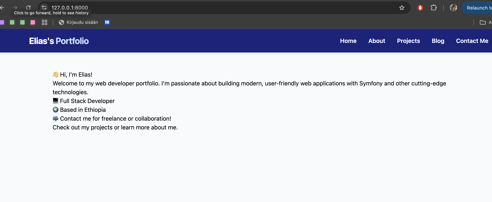
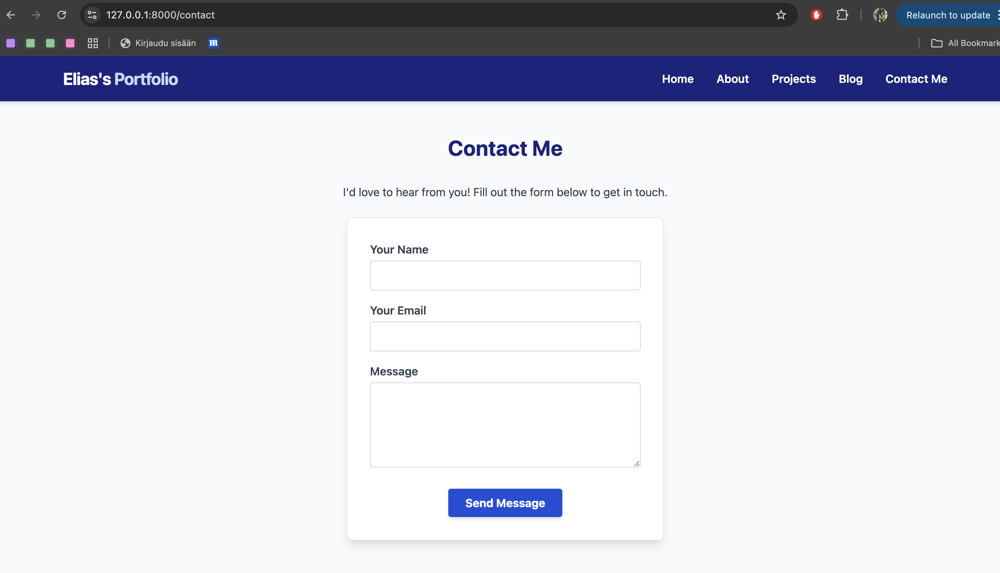

# Symfony Portfolio App

A personal portfolio website built with symfony to showcase a web development skills, projects, and contact information. A simple portfolio project.

---

## Project Setup

### 1. Create the Project

To create this project, run:

```bash
symfony new [projectName] --webapp
```

This will generate a new Symfony app with the webapp skeleton in your desired directory.

### 2. Install Dependencies
```

### 3. Install Tailwind CSS

```bash
npm install -D tailwindcss@latest postcss@latest autoprefixer@latest
```

### 4. Install Webpack

```bash
npm install -D @symfony/webpack-encore
```

### 5. Configure Webpack

```bash
npx encore init
```

### 6. Add Tailwind CSS Configuration

```bash
npx tailwindcss init
```

### 7. Add Tailwind CSS to CSS

```css
/* assets/css/app.css */
@import 'tailwindcss/base';
@import 'tailwindcss/components';
@import 'tailwindcss/utilities';
```

---

## Steps Completed


### 2. Scaffold Controllers and Pages
- Created `PageController` for Home (`/`), About (`/about`), and Contact (`/contact`).
- Created `ProjectController` for Projects (`/projects`).

### 3. Add Twig Templates
- Each page has its own Twig template in `templates/page/` or `templates/project/`.
- All templates extend `base.html.twig` for a consistent layout.

### 4. Add Navigation Bar
- Simple navigation bar added to `base.html.twig` for easy access to all pages.

### 5. Add Sample Content
- Each page now contains sample content (bio, skills, projects, contact info).

### 6. Contact Form
- The Contact page (`/contact`) now features a working form (Name, Email, Message).
- Submissions are validated and a confirmation message is shown on success.
- (u can extend this to send emails or save messages to a database.)

### 7. Add Tailwind CSS
- Tailwind CSS is added for styling.

### 8. Add Webpack
- Webpack is added for asset management.

### 9. Add Contact Form
- The Contact page (`/contact`) now features a working form (Name, Email, Message).
- Submissions are validated and a confirmation message is shown on success.
- (u can extend this to send emails or save messages to a database.)

### 10. Add Projects
- Created `ProjectController` for Projects (`/projects`).

### 11. Add Blog Posts
- Created `BlogPostController` for Blog Posts (`/blog`).
- https://127.0.0.1:8000/blog/new (add new blog post)
- https://127.0.0.1:8000/blog/1 (show blog post)
- https://127.0.0.1:8000/blog/1/edit (edit blog post)
- https://127.0.0.1:8000/blog/1/delete (delete blog post)

### 12. Add Blog Post Templates
- Created Twig templates for blog posts in `templates/blog_post/`.

### 13. Add Blog Post Form
- Created a form for blog posts in `src/Form/BlogPostType.php`.

### 14. Add Blog Post Controller
- Created a controller for blog posts in `src/Controller/BlogPostController.php`.

### 15. Add Blog Post Routes
- Added routes for blog posts in `config/routes.yaml`.

### 16. Add Blog Post Templates
- Created Twig templates for blog posts in `templates/blog_post/`.

### 17. Add Blog Post Controller
- Created a controller for blog posts in `src/Controller/BlogPostController.php`.

### 18. Add Blog Post Form
- Created a form for blog posts in `src/Form/BlogPostType.php`.

### 19. Add Blog Post Routes
- Added routes for blog posts in `config/routes.yaml`.

### 20. Add Blog Post Templates
- Created Twig templates for blog posts in `templates/blog_post/`.


---

## How the Contact Form Works

1. **Form Class:** `src/Form/ContactType.php` defines the fields.
2. **Controller:** Handles displaying and processing the form.
3. **Template:** Renders the form and shows a thank you message after submission.

To try it:
- Go to `/contact`, fill out the form, and submit.
- You’ll see a success message if all fields are valid.

---

## Possible Next Steps to enhance the project and deepen the understanding
- Make the Projects page dynamic.
- Add email sending or message storage for the contact form.
- Improve styling with CSS or a framework.
- Deploy my portfolio online.

---

## Development

To start the local development server:

```bash
cd [symfony_app]
symfony serve
```

Visit your site at [http://127.0.0.1:8000](http://127.0.0.1:8000)

**Home page**

The overall home page looks as depicted in the screenshot: 



**About page**

The project about page:


**Contact page**

The project also have a form submission feature the form submitted will be in the backend:




---

## License
MIT
